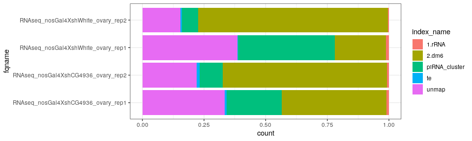
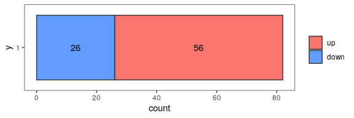
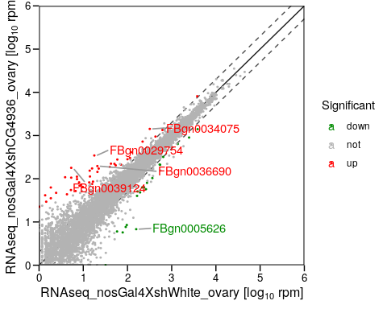
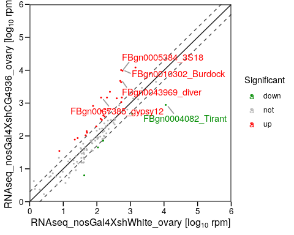
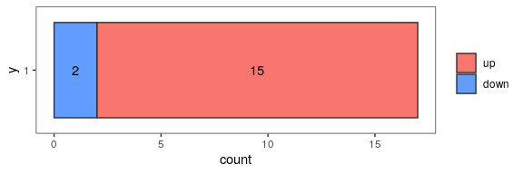

## 1 Number of mapped reads

<!--html_preserve--><div id="htmlwidget-43019487e32d9649c0f6" style="width:100%;height:auto;" class="datatables html-widget"></div>
<script type="application/json" data-for="htmlwidget-43019487e32d9649c0f6">{"x":{"filter":"top","filterHTML":"<tr>\n  <td><\/td>\n  <td data-type=\"character\" style=\"vertical-align: top;\">\n    <div class=\"form-group has-feedback\" style=\"margin-bottom: auto;\">\n      <input type=\"search\" placeholder=\"All\" class=\"form-control\" style=\"width: 100%;\"/>\n      <span class=\"glyphicon glyphicon-remove-circle form-control-feedback\"><\/span>\n    <\/div>\n  <\/td>\n  <td data-type=\"integer\" style=\"vertical-align: top;\">\n    <div class=\"form-group has-feedback\" style=\"margin-bottom: auto;\">\n      <input type=\"search\" placeholder=\"All\" class=\"form-control\" style=\"width: 100%;\"/>\n      <span class=\"glyphicon glyphicon-remove-circle form-control-feedback\"><\/span>\n    <\/div>\n    <div style=\"display: none; position: absolute; width: 200px;\">\n      <div data-min=\"6911677\" data-max=\"15089982\"><\/div>\n      <span style=\"float: left;\"><\/span>\n      <span style=\"float: right;\"><\/span>\n    <\/div>\n  <\/td>\n  <td data-type=\"integer\" style=\"vertical-align: top;\">\n    <div class=\"form-group has-feedback\" style=\"margin-bottom: auto;\">\n      <input type=\"search\" placeholder=\"All\" class=\"form-control\" style=\"width: 100%;\"/>\n      <span class=\"glyphicon glyphicon-remove-circle form-control-feedback\"><\/span>\n    <\/div>\n    <div style=\"display: none; position: absolute; width: 200px;\">\n      <div data-min=\"49162\" data-max=\"96644\"><\/div>\n      <span style=\"float: left;\"><\/span>\n      <span style=\"float: right;\"><\/span>\n    <\/div>\n  <\/td>\n  <td data-type=\"integer\" style=\"vertical-align: top;\">\n    <div class=\"form-group has-feedback\" style=\"margin-bottom: auto;\">\n      <input type=\"search\" placeholder=\"All\" class=\"form-control\" style=\"width: 100%;\"/>\n      <span class=\"glyphicon glyphicon-remove-circle form-control-feedback\"><\/span>\n    <\/div>\n    <div style=\"display: none; position: absolute; width: 200px;\">\n      <div data-min=\"1550643\" data-max=\"11632409\"><\/div>\n      <span style=\"float: left;\"><\/span>\n      <span style=\"float: right;\"><\/span>\n    <\/div>\n  <\/td>\n  <td data-type=\"integer\" style=\"vertical-align: top;\">\n    <div class=\"form-group has-feedback\" style=\"margin-bottom: auto;\">\n      <input type=\"search\" placeholder=\"All\" class=\"form-control\" style=\"width: 100%;\"/>\n      <span class=\"glyphicon glyphicon-remove-circle form-control-feedback\"><\/span>\n    <\/div>\n    <div style=\"display: none; position: absolute; width: 200px;\">\n      <div data-min=\"966954\" data-max=\"2944980\"><\/div>\n      <span style=\"float: left;\"><\/span>\n      <span style=\"float: right;\"><\/span>\n    <\/div>\n  <\/td>\n  <td data-type=\"integer\" style=\"vertical-align: top;\">\n    <div class=\"form-group has-feedback\" style=\"margin-bottom: auto;\">\n      <input type=\"search\" placeholder=\"All\" class=\"form-control\" style=\"width: 100%;\"/>\n      <span class=\"glyphicon glyphicon-remove-circle form-control-feedback\"><\/span>\n    <\/div>\n    <div style=\"display: none; position: absolute; width: 200px;\">\n      <div data-min=\"19907\" data-max=\"123127\"><\/div>\n      <span style=\"float: left;\"><\/span>\n      <span style=\"float: right;\"><\/span>\n    <\/div>\n  <\/td>\n  <td data-type=\"number\" style=\"vertical-align: top;\">\n    <div class=\"form-group has-feedback\" style=\"margin-bottom: auto;\">\n      <input type=\"search\" placeholder=\"All\" class=\"form-control\" style=\"width: 100%;\"/>\n      <span class=\"glyphicon glyphicon-remove-circle form-control-feedback\"><\/span>\n    <\/div>\n    <div style=\"display: none; position: absolute; width: 200px;\">\n      <div data-min=\"2251338\" data-max=\"2884552\"><\/div>\n      <span style=\"float: left;\"><\/span>\n      <span style=\"float: right;\"><\/span>\n    <\/div>\n  <\/td>\n<\/tr>","data":[["1","2","3","4"],["RNAseq_nosGal4XshCG4936_ovary_rep1","RNAseq_nosGal4XshCG4936_ovary_rep2","RNAseq_nosGal4XshWhite_ovary_rep1","RNAseq_nosGal4XshWhite_ovary_rep2"],[6911677,10224380,7496726,15089982],[66279,81361,96644,49162],[2946053,6801600,1550643,11632409],[1533665,966954,2944980,984412],[51964,123127,19907,106006],[2313716,2251338,2884552,2317993]],"container":"<table class=\"display\">\n  <thead>\n    <tr>\n      <th> <\/th>\n      <th>fqname<\/th>\n      <th>total<\/th>\n      <th>1.rRNA<\/th>\n      <th>2.dm6<\/th>\n      <th>piRNA_cluster<\/th>\n      <th>te<\/th>\n      <th>unmap<\/th>\n    <\/tr>\n  <\/thead>\n<\/table>","options":{"pageLength":10,"scrollX":true,"columnDefs":[{"className":"dt-right","targets":[2,3,4,5,6,7]},{"orderable":false,"targets":0}],"order":[],"autoWidth":false,"orderClasses":false,"orderCellsTop":true}},"evals":[],"jsHooks":[]}</script><!--/html_preserve-->


<!-- -->


## 2 Genes

### 2.1 Info


```
fold_change:  log2( RNAseq_nosGal4XshCG4936_ovary / RNAseq_nosGal4XshWhite_ovary )
Project:      RNAseq_nosGal4XshWhite_ovary.vs.RNAseq_nosGal4XshCG4936_ovary, 
Reference:    dm6
Feature:      gene
control:      RNAseq_nosGal4XshWhite_ovary
treatment:    RNAseq_nosGal4XshCG4936_ovary
```

### 2.2 Number of differentially expressed genes

Here are the numbers of significant changed genes, criteria: `foldChange >= 2, pvalue < 0.05`


type    count
-----  ------
up         56
down       26

<!-- -->

<!-- -->

### 2.3 Up-regulated genes

<!--html_preserve--><div id="htmlwidget-1169b5c9f41425c613dd" style="width:100%;height:auto;" class="datatables html-widget"></div>
<script type="application/json" data-for="htmlwidget-1169b5c9f41425c613dd">{"x":{"filter":"none","extensions":["Buttons"],"data":[["1","2","3","4","5","6","7","8","9","10","11","12","13","14","15","16","17","18","19","20","21","22","23","24","25","26","27","28","29","30","31","32","33","34","35","36","37","38","39","40","41","42","43","44","45","46","47","48","49","50","51","52","53","54","55","56"],["FBgn0002565","FBgn0004191","FBgn0004581","FBgn0010019","FBgn0013278","FBgn0014342","FBgn0016054","FBgn0017448","FBgn0025739","FBgn0029696","FBgn0029754","FBgn0030438","FBgn0030484","FBgn0030660","FBgn0030716","FBgn0030816","FBgn0030955","FBgn0031018","FBgn0031053","FBgn0031296","FBgn0031343","FBgn0031865","FBgn0031913","FBgn0031975","FBgn0033774","FBgn0033820","FBgn0034075","FBgn0035113","FBgn0035539","FBgn0036690","FBgn0037521","FBgn0037565","FBgn0038612","FBgn0039124","FBgn0039232","FBgn0039343","FBgn0040732","FBgn0051202","FBgn0051661","FBgn0052602","FBgn0062928","FBgn0063494","FBgn0083008","FBgn0083035","FBgn0083036","FBgn0083037","FBgn0085195","FBgn0086055","FBgn0261560","FBgn0262598","FBgn0262895","FBgn0265638","FBgn0266710","FBgn0266850","FBgn0267320","FBgn0267967"],[1.37473613001139,20.6878212502261,3.88639805731488,617.229484835711,14.1708560992481,6.71335602669392,54.1878220836405,120.112324048582,219.623612785395,50.7302720301103,17.7833775714908,430.189291625005,16.6050323171953,42.2854643743261,49.3087632384451,43.9754965464131,28.6623614452223,1.84500359079948,39.8873544087317,13.9744652235322,8.24306357541786,15.8608882713351,71.6144841560524,14.4500858889709,0.196390875715913,8.83223620256561,319.430190925881,14.2122755562515,13.6231029291038,20.8481458735892,28.1867407797837,22.3832066269636,15.8194688143317,5.33861989668253,9.73670487178891,2.43417621794722,5.26113418732627,1.84500359079948,58.9372693531753,3778.25790555278,117.233240212898,113.703557654662,13.70058863846,5.33861989668253,0,0.196390875715913,7.22504294448541,1886.61082728011,99.9508431498981,7.18362348748204,8.04667269970195,0.392781751431826,4.27917980874671,0,1.45222183936765,20.9256315829454],[41.4646176882636,89.0722532468106,108.438647753198,1344.96484739336,112.735782551257,51.9839094082252,204.539864473556,411.06950352431,724.274134619211,221.695512720521,345.614531475596,946.428036176815,85.9611747858592,223.307066949442,144.975077104816,137.06119746519,105.990484338918,35.3986799952305,188.081051655716,153.820121016873,68.7438623970934,75.8046873787256,211.870997555316,74.9043551771961,20.0293095530586,72.3924687467464,1422.93300348797,68.8384174841629,82.4389850313603,196.657846342013,103.684153555241,172.126875781307,173.217347594161,178.887590029096,64.6995607893431,47.1821376667342,54.8596295886874,62.7416477202297,278.307499731549,8126.48015937815,275.939504806073,304.120111153617,69.1868351987254,105.991513776102,22.8885842608861,21.3561690835855,97.9358015058712,4490.52337294792,282.447385863553,111.708004317388,82.5818470991493,49.4884684504102,43.7226414912202,22.1300846899609,29.4118813538168,144.042883395202],[4.28934979005403,2.33183550589941,5.32681214654098,1.10926508549351,3.3573426877801,3.15164145542209,1.86367722613912,1.75657872821725,1.75683837492577,2.09722825767555,4.62949951842832,1.12548643294664,2.64656679260155,2.43886109122914,1.65840502130969,1.63458579816909,1.89110085845105,4.87565581296216,2.36021432305498,3.8952088965798,3.5804477598865,2.3893857765173,1.58871082655549,2.28476063885978,5.49654114116048,3.4741092820976,2.17525668690397,2.3883608041856,2.74521206090327,3.30692605338803,2.04494330385701,2.80092937506568,3.86054484616911,5.7836435403043,2.84902598071419,4.44816998164141,3.4401378892239,5.76386062067717,2.20194373317978,1.10201630394743,1.27214737659363,1.43624545494995,2.5527994572561,4.92238488403816,6.84773639568962,5.59035902433806,3.6315355032506,1.25308654992596,1.57536921834655,4.51040003237465,3.9255127314194,6.12104908037816,3.62906176493365,6.81331147212346,5.78892263154269,2.91429511205522],[0.0179506165691946,0.0760008846136996,5.82674600097845e-08,0.0293138798378967,0.000486821785715244,0.0280511872300369,0.0046287948696086,0.000265225713037662,1.65869719534959e-05,0.000144150410860308,9.32100663134247e-17,0.00841307173471558,0.0257887042013778,7.30221659733447e-06,0.0991807754727588,0.059866893482388,0.0500961818059371,0.0147311015119076,0.000265225713037662,3.02022648169632e-06,0.0087157844536269,0.040193644695923,0.0157165731730614,0.0587959742154124,0.0887508951043323,0.00437057592128393,3.47999790194784e-10,0.0561279213662338,0.00618383933404012,2.18446207355527e-08,0.0701979883419178,2.95090982777588e-05,1.53884838934982e-06,9.69583461268505e-12,0.018383234859558,0.00283887094715155,0.00990883382232693,7.20371319215867e-05,9.67871695887608e-06,0.0052209864530632,0.0824909250039365,0.0177672804836297,0.0815400164041032,1.69120811876366e-06,0.0307130199674932,0.0651877621290226,0.000110241133013233,0.0538261569532566,0.0399101268869315,1.69120811876366e-06,0.00252450332993009,0.000323383003001751,0.0269201995065805,0.0307130199674932,0.0244930132175801,2.36740486665241e-05],["up","up","up","up","up","up","up","up","up","up","up","up","up","up","up","up","up","up","up","up","up","up","up","up","up","up","up","up","up","up","up","up","up","up","up","up","up","up","up","up","up","up","up","up","up","up","up","up","up","up","up","up","up","up","up","up"],["Lsp2",null,"bgcn","Cyp4g1","Hsp70Ba","mia","phr6-4","CG2187","pon","CG15571","CG15930","CG15721","GstT4","CG8097","CG9170","CG16700","CG6891","CG12200","CG14223","CG4415","CG18131","Nha1","CG5958","Tg","CG12374","CG4716","Asph","pyx","slow","Ilp8","CG2993","CG9626","cona","tbrd-1","sosie","CG5111","CG16926","alpha-Man-Ic","CG31661",null,null,"GstE6",null,null,null,null,"CG34166",null,"Thor","mtsh",null,null,"hog",null,null,"corolla"]],"container":"<table class=\"display\">\n  <thead>\n    <tr>\n      <th> <\/th>\n      <th>Gene<\/th>\n      <th>RNAseq_nosGal4XshWhite_ovary<\/th>\n      <th>RNAseq_nosGal4XshCG4936_ovary<\/th>\n      <th>log2FoldChange<\/th>\n      <th>padj<\/th>\n      <th>sig<\/th>\n      <th>symbol<\/th>\n    <\/tr>\n  <\/thead>\n<\/table>","options":{"dom":"Bfrtip","buttons":["copy",{"extend":"collection","buttons":["excel","csv"],"text":"Download"}],"columnDefs":[{"className":"dt-right","targets":[2,3,4,5]},{"orderable":false,"targets":0}],"order":[],"autoWidth":false,"orderClasses":false}},"evals":[],"jsHooks":[]}</script><!--/html_preserve-->


### 2.4 Down-regulated genes

<!--html_preserve--><div id="htmlwidget-bce3ef8675b418001bc7" style="width:100%;height:auto;" class="datatables html-widget"></div>
<script type="application/json" data-for="htmlwidget-bce3ef8675b418001bc7">{"x":{"filter":"none","extensions":["Buttons"],"data":[["1","2","3","4","5","6","7","8","9","10","11","12","13","14","15","16","17","18","19","20","21","22","23","24","25","26"],["FBgn0002926","FBgn0005626","FBgn0010317","FBgn0011259","FBgn0012016","FBgn0016726","FBgn0027091","FBgn0033593","FBgn0033773","FBgn0035087","FBgn0036899","FBgn0037811","FBgn0038768","FBgn0039163","FBgn0052082","FBgn0052364","FBgn0052512","FBgn0082925","FBgn0260396","FBgn0260942","FBgn0261615","FBgn0262484","FBgn0264000","FBgn0264384","FBgn0264385","FBgn0265767"],[3861.68287979119,157.596215287069,164.630220560489,381.659332504573,168.574097688759,2473.17684099704,358.021701094158,31.8767479613827,261.723392693306,547.902099527793,38.4819052310179,192.796954701871,276.556960104607,534.312522006793,99.9308365114967,32.3577218314718,1371.05347384639,365.652773043625,91.2842847753461,643.699427420155,58.1102863933083,77.9764778883179,96.4839928672678,237.485882246442,50.332137074028,214.632408158691],[1405.10414582248,6.80799179132376,40.1377581577366,167.769106278633,50.7999119454871,899.546009243923,158.49547616321,0,57.275931494883,209.975778065187,4.58080005926725,48.2726094795873,80.4009034734429,213.513383855137,29.6174370005905,1.92708099821333,637.791877417284,103.542320924637,7.66104644931857,319.677562332743,6.03407618494842,5.73396545110524,8.51410110731337,63.3891467314508,5.52840980433156,62.9307578943687],[-1.46114123047529,-4.46709506784933,-2.06845871406549,-1.18154688009032,-1.77520043367014,-1.46125555709544,-1.18063237174709,-7.48329917415078,-2.18493242288735,-1.38340329433982,-3.09098820566633,-2.04106792803909,-1.79655923909105,-1.34134908284906,-1.78982999682743,-4.03405347381662,-1.11277284477004,-1.80128709456734,-3.60171807257882,-1.01434078055098,-3.32544445249808,-3.84791035723242,-3.63526196239631,-1.93749782411651,-3.00742225298622,-1.78877640827258],[0.00077300053630279,2.18762587943353e-10,0.00283887094715155,0.0792368447452654,0.0238824271331687,1.69120811876366e-06,0.0579760258552021,0.004981158381279,1.07879174122951e-05,0.00283887094715155,0.0999001604041687,0.00151342671578218,0.00141792249067839,0.0149058411976282,0.0973356965251128,0.0591649497369788,0.0280511872300369,0.00283887094715155,3.85569677455064e-05,0.0454614963456071,0.00548892900761353,9.28449893373931e-05,0.000106032189982004,0.00091453228261506,0.0798870061756433,0.0046287948696086],["down","down","down","down","down","down","down","down","down","down","down","down","down","down","down","down","down","down","down","down","down","down","down","down","down","down"],["ndl","ple","CycJ","Sema1a",null,"RpL29","CysRS","Listericin","Mos","CG2765","tey","CG12592","CG4936","CG5515","IRSp53","tut","CG32512",null,"CG42521","bond","CG42704","CG43074","GluRIB",null,null,"zyd"]],"container":"<table class=\"display\">\n  <thead>\n    <tr>\n      <th> <\/th>\n      <th>Gene<\/th>\n      <th>RNAseq_nosGal4XshWhite_ovary<\/th>\n      <th>RNAseq_nosGal4XshCG4936_ovary<\/th>\n      <th>log2FoldChange<\/th>\n      <th>padj<\/th>\n      <th>sig<\/th>\n      <th>symbol<\/th>\n    <\/tr>\n  <\/thead>\n<\/table>","options":{"dom":"Bfrtip","buttons":["copy",{"extend":"collection","buttons":["excel","csv"],"text":"Download"}],"columnDefs":[{"className":"dt-right","targets":[2,3,4,5]},{"orderable":false,"targets":0}],"order":[],"autoWidth":false,"orderClasses":false}},"evals":[],"jsHooks":[]}</script><!--/html_preserve-->


## 3 Transposon Element (TE)


### 3.1 Number of differentially expressed TE

Here are the numbers of significant changed genes, criteria: `foldChange >= 2, pvalue < 0.05`


type    count
-----  ------
up         26
down        9

<!-- -->

<!-- -->

### 3.2 All TEs

<!--html_preserve--><div id="htmlwidget-1262ddde817b1d4701f7" style="width:100%;height:auto;" class="datatables html-widget"></div>
<script type="application/json" data-for="htmlwidget-1262ddde817b1d4701f7">{"x":{"filter":"none","extensions":["Buttons"],"data":[["1","2","3","4","5","6","7","8","9","10","11","12","13","14","15","16","17","18","19","20","21","22","23","24","25","26","27","28","29","30","31","32","33","34","35","36","37","38","39","40","41","42","43","44","45","46","47","48","49","50","51","52","53","54","55","56","57","58","59","60","61","62","63","64","65","66","67","68","69","70","71","72","73","74","75","76","77","78","79","80","81","82","83","84","85","86","87","88","89","90","91","92","93","94","95","96","97","98","99","100","101","102","103","104","105","106","107","108","109","110","111","112","113","114","115","116","117","118","119","120","121","122","123","124","125","126","127"],["FBgn0000199_blood","FBgn0001207_HMS-Beagle","FBgn0001249_I-element","FBgn0002698_mdg3","FBgn0002745_micropia","FBgn0003490_springer","FBgn0003908_R1A1-element","FBgn0003909_R2-element","FBgn0004141_HeT-A","FBgn0004904_TART-C","FBgn0005384_3S18","FBgn0005773_Bari1","FBgn0010302_Burdock","FBgn0040267_Transpac","FBgn0043055_Ivk","FBgn0043969_diver","FBgn0044355_Quasimodo","FBgn0046110_Juan","FBgn0061485_rover","FBgn0063431_gypsy6","FBgn0063447_accord","FBgn0063504_G5","FBgn0063917_McClintock","FBgn0063919_Max-element","FBgn0067385_gypsy12","FBgn0069343_TAHRE","FBgn0000006_412","FBgn0003519_Stalker","FBgn0004082_Tirant","FBgn0010103_aurora-element","FBgn0026410_Tc1","FBgn0063467_Rt1c","FBgn0067383_gypsy8","FBgn0067387_gypsy10","FBgnnnnnnnn_HMS-Beagle2","FBgn0000004_17.6","FBgn0000005_297","FBgn0000007_1731","FBgn0000155_roo","FBgn0000224_BS","FBgn0000349_copia","FBgn0000481_Doc","FBgn0000638_FB","FBgn0000652_F-element","FBgn0001100_G-element","FBgn0001167_gypsy","FBgn0001181_HB","FBgn0001210_hobo","FBgn0001283_jockey","FBgn0002697_mdg1","FBgn0002949_NOF","FBgn0003007_opus","FBgn0003055_P-element","FBgn0003122_pogo","FBgn0004904_TART-A","FBgn0004904_TART-B","FBgn0004905_S-element","FBgn0005673_1360","FBgn0014947_flea","FBgn0014967_hopper","FBgn0015786_Porto1","FBgn0015945_GATE","FBgn0020425_Helena","FBgn0022937_Circe","FBgn0023131_ZAM","FBgn0026065_Idefix","FBgn0026416_INE-1","FBgn0041728_Rt1a","FBgn0042231_X-element","FBgn0042682_Rt1b","FBgn0045970_Tabor","FBgn0046701_Penelope","FBgn0061191_Tc3","FBgn0061513_frogger","FBgn0062343_Dm88","FBgn0063369_transib4","FBgn0063370_transib3","FBgn0063371_transib2","FBgn0063372_transib1","FBgn0063394_rooA","FBgn0063401_mariner2","FBgn0063402_looper1","FBgn0063425_jockey2","FBgn0063426_invader5","FBgn0063427_invader4","FBgn0063428_invader3","FBgn0063429_invader2","FBgn0063430_invader1","FBgn0063432_gypsy5","FBgn0063433_gypsy4","FBgn0063434_gypsy3","FBgn0063435_gypsy2","FBgn0063436_gtwin","FBgn0063439_diver2","FBgn0063440_baggins","FBgn0063450_Tom1","FBgn0063454_Stalker3","FBgn0063455_Stalker2","FBgn0063466_S2","FBgn0063503_G6","FBgn0063505_G4","FBgn0063506_G3","FBgn0063507_G2","FBgn0063533_Doc3-element","FBgn0063534_Doc2-element","FBgn0063594_Cr1a","FBgn0063755_Osvaldo","FBgn0063782_accord2","FBgn0063897_Stalker4","FBgn0063900_Q-element","FBgn0064134_Bari2","FBgn0067380_invader6","FBgn0067381_hopper2","FBgn0067382_gypsy9","FBgn0067384_gypsy7","FBgn0067386_gypsy11","FBgn0067405_R1-2","FBgn0067418_Helitron","FBgn0067419_G7","FBgn0067420_Fw3","FBgn0067421_Fw2","FBgn0067623_BS4","FBgn0067624_BS3","FBgn0069340_Tc1-2","FBgn0069433_G5A","FBgn0069587_Doc4-element","FL10B_lww"],[1412.42074531205,555.024053486012,529.561414128424,391.753222061123,141.235397488717,132.089316022107,533.343415758563,129.845754131026,211.606254996459,50.9453476501792,527.695780403679,7.64680992939295,581.734481350867,155.812766791334,95.7378114934372,496.531613969103,171.145117277305,22.0519077550642,245.386128499046,49.9847097774392,46.325120592915,26.8332778851285,77.0788487980312,200.105327597301,133.56633075103,177.020666129872,1126.61843028509,154.479983741663,11273.6100114394,39.0281990321602,40.666356833883,42.1157693397676,107.977246257056,75.4019603691235,151.564684911002,315.801499623376,1705.29522594353,259.519236785107,5770.44864370701,186.521981379864,1210.41727392687,2195.71434251268,312.558131657713,637.80039667026,34.4578310062278,462.224235206187,25.6892401312948,51.2952360188173,176.293287169556,341.612714625628,154.224905595601,338.192167342931,346.86551042063,39.7667063966215,165.836241886912,103.934383491454,89.5292856657821,214.443654998092,1192.51688753093,40.199839009032,108.865768290171,99.7860196737848,6.09189637144245,33.0084185003432,65.4893317403568,120.938276991587,148.271457914007,66.3778537734715,68.8435461728301,143.173584627745,213.499490944242,0,8.09107094595024,69.7320682059447,126.264063775531,6.43065633593382,7.42467942111431,73.286156338403,1.99917457450778,223.512275210331,14.0774662653268,15.4102493149986,35.5796119517678,14.721600981869,111.264690264648,82.1379914571083,806.753123811792,43.4374239852926,35.10196572277,191.736921696996,34.3745867624556,41.8103945877167,23.7011939609338,42.2323987959803,72.4808785490607,23.7955666088529,1.33278304967185,173.438538199717,4.22047965729421,49.2016887963905,145.661533835398,3.99834914901557,39.2169443279984,572.539416002242,165.925269120086,99.3640154655211,11.6451590784085,42.3378998480462,153.147200691991,2.65443769519689,3.88171969280284,30.8093702258505,0.88852203311457,15.9600113836218,20.5192510054074,9.63485609975388,1.43828410173777,0,2.22130508278643,28.1549325306536,20.1804910409161,0,4.88687118213014,161.643802027314,48.9684298839651,40.3387252735385,266.866454951851],[12111.8491269828,1478.5106812441,4302.58407815427,1394.8644217958,306.447698799094,583.849921766379,1076.31970601468,331.498407201917,601.688505614259,125.483112478829,10096.9215761143,34.939567022595,9652.87987708928,420.79289094994,194.114042522458,4718.51745275261,392.045957238792,77.5217400861411,2197.74200888223,139.197562652324,104.445183344631,86.5393432541036,817.590085837172,1473.76973607545,1471.51919496338,651.847743889408,469.436615666238,74.6389487601227,879.514348414358,15.2792081353565,15.7795189839604,6.32457267679406,44.7084941701129,35.6926064154491,70.9461542783957,293.422462602404,1300.34704899417,303.759814547822,4427.53514463847,198.618555573192,1380.4727655386,2917.60644444094,251.46996663286,593.110818705449,21.3527676811991,857.109141512992,16.4057652513647,37.821500641964,171.823620853451,341.759068131545,83.0303056606809,225.983630504133,310.952211849829,30.4945908546633,140.01099663463,80.4614951750141,71.6336528419014,220.789903476593,2261.54329484832,22.0411239513543,86.6618478463065,91.5484556866888,5.82340412154073,43.0807684988512,72.5100545336077,164.684756487701,130.306752609811,67.6277352264722,62.3676096629356,168.379266382727,293.356064066406,0,5.57324869723875,36.443072688355,95.9287487319215,3.25630904917262,21.6029231055011,59.5495014596162,2.31693964806613,162.931953104288,16.7188883850669,7.26394207790056,28.9298328928018,5.38520327568757,89.4790983429768,82.9069433618286,634.243019039492,44.9595073010642,15.4042858475074,120.475715459542,40.200550292781,28.3035866253975,9.07971317071334,38.196733778417,74.0773856154173,24.4201736021712,4.25778845302992,96.3031241617251,6.0114495430919,36.8821312408575,80.3381328761618,7.76425292650455,57.6086526546523,537.007387129855,239.323705247824,144.835494472262,3.69450989502578,19.9130874314886,76.8946361120874,1.69069338066181,5.57324869723875,30.9319339938671,2.88021820607028,20.1632428557906,14.3389810276006,8.14034376960686,2.44201736021713,0,0.313123133702162,14.5270264491518,18.1594263414267,0,7.32605208065137,99.8138771684467,40.2635180021812,31.4339602557698,300.309456130552],[3.10270671224909,1.40988436839388,3.03489339890471,1.82937381426201,1.13810041424735,2.14446911331456,1.02270264481879,1.36772141622584,1.49211842198942,1.35706080526467,4.26885141326628,2.14008571848978,4.06065837093903,1.4305687196523,1.02268875294975,3.24935748275659,1.21393726069686,1.82223435559072,3.18810115796369,1.4516123866647,1.15196858233481,1.61107982157254,3.46884808429866,2.88662929151265,3.49930493680477,1.86360345133954,-1.26496290248717,-1.06601266123689,-3.68174733586618,-1.34443488126675,-1.37246743147676,-2.65994596725647,-1.30948370785281,-1.10301091367465,-1.1152155209049,-0.108126140243601,-0.387958325508341,0.24523813891349,-0.381338249299392,0.103130550658923,0.188999637872103,0.407255214441014,-0.301461506218196,-0.1044427622683,-0.658988566777002,0.87972513090355,-0.551135001754515,-0.400486011133672,-0.0598139878282365,0.0059356938369762,-0.935802930296444,-0.586265551982949,-0.141429120824865,-0.344309482293361,-0.235283933621122,-0.38413297016797,-0.325148896250207,0.0610924053292875,0.928934650603963,-0.815868735627312,-0.364604769975979,-0.0741286955819006,0.0141230015390067,0.44023419554465,0.135926645736285,0.48412340879893,-0.189555873203276,0.0357701594263572,-0.17083829181954,0.234411638498784,0.477121694740533,null,-0.477650302175936,-0.983096960495358,-0.428744927482697,-0.934523026658587,1.52597380105628,-0.338377154662938,-0.0533588255244815,-0.45291454043903,0.199947542138009,-1.06032163230891,-0.303000824439277,-1.26148329198131,-0.331581385618334,0.000260279447804504,-0.355729238922778,0.0557170588880345,-1.06930498354146,-0.699543787750036,0.152168885846972,-0.616902083606693,-1.2779302780284,-0.177558214969731,0.0291322701723091,0.167164113445908,1.17259328156365,-0.843391890814729,0.23072467273299,-0.403822521753516,-0.879849311594651,0.562947988667531,0.599088990330669,-0.101550479069176,0.514460651119185,0.575502059392012,-1.70377275209786,-1.04921558890784,-0.991424217136552,-0.221079069118274,0.448260128507677,-0.0517070871945102,1.15721678001805,0.333225413684833,-0.668858452528911,-0.122482893022976,1.22162465668172,null,-2.53919301686729,-1.0200639079855,-0.206447093260147,null,0.234718662235841,-0.707912473539235,-0.245313124448873,-0.369788665362509,0.161782422493794],[9.76492497573228e-20,0.000180107684986422,9.08110924457811e-13,2.39880893624025e-07,0.0112985927524203,1.2275342770165e-08,0.0287052288291263,0.00115271433686196,0.000190993461507663,0.0127640652111465,3.52393225785574e-28,0.00930474088332737,2.14486610217177e-30,0.00042277217457436,0.0302734445637009,5.43857206467765e-22,0.00477147910094715,0.00174597090229879,1.04724179345428e-15,0.00316290331005826,0.0322820979887481,0.00753896974339004,9.33778663221125e-18,9.67910679198132e-17,7.89826739608249e-20,1.15533358231145e-06,0.00115795430320616,0.0321769409920104,1.53498034017919e-20,0.0922055459116112,0.0600241427973572,0.000526732571018954,0.0153314913971016,0.0899028174454689,0.0337717028382343,0.904838760626322,0.679791647286351,0.752330731010475,0.640871124337275,0.913860442268625,0.778886140398512,0.549962834686419,0.679791647286351,0.904838760626322,0.505999795543019,0.0562823936155843,0.679791647286351,0.679791647286351,0.958475873888096,0.997302664021203,0.195548340763594,0.244621074916483,0.904838760626322,0.752330731010475,0.765029771180235,0.66175687101351,0.692193474397569,0.955077259038342,0.0757219523341584,0.35762119037406,0.679791647286351,0.955077259038342,0.997302664021203,0.679791647286351,0.904838760626322,0.493302860228859,0.822129259486473,0.974640508174071,0.893679303011977,0.764002419721958,0.514566608051165,null,0.827427799517404,0.12461484546563,0.567848141423051,0.682054493568647,0.12461484546563,0.703990389614952,0.997302664021203,0.460694477596456,0.904838760626322,0.439012699750431,0.797191953230288,0.374765150681701,0.679791647286351,0.999520492720547,0.640871124337275,0.96317737122812,0.229171681727989,0.244621074916483,0.904838760626322,0.545543246140446,0.205616248249755,0.904838760626322,0.977927525755624,0.916880147316489,0.703610997158797,0.148696200837407,0.946594375315293,0.679791647286351,0.0961697628766958,0.822129259486473,0.460694477596456,0.904838760626322,0.367157363390724,0.35762119037406,0.229171681727989,0.191836759576035,0.044092063926096,0.96317737122812,0.893679303011977,0.974640508174071,0.765029771180235,0.822129259486473,0.640871124337275,0.960034940551254,0.752330731010475,null,0.567848141423051,0.260119803681654,0.904838760626322,null,0.940599418098254,0.229171681727989,0.822129259486473,0.718663377357104,0.839538391807084],["up","up","up","up","up","up","up","up","up","up","up","up","up","up","up","up","up","up","up","up","up","up","up","up","up","up","down","down","down","down","down","down","down","down","down","not","not","not","not","not","not","not","not","not","not","not","not","not","not","not","not","not","not","not","not","not","not","not","not","not","not","not","not","not","not","not","not","not","not","not","not","not","not","not","not","not","not","not","not","not","not","not","not","not","not","not","not","not","not","not","not","not","not","not","not","not","not","not","not","not","not","not","not","not","not","not","not","not","not","not","not","not","not","not","not","not","not","not","not","not","not","not","not","not","not","not","not"]],"container":"<table class=\"display\">\n  <thead>\n    <tr>\n      <th> <\/th>\n      <th>Gene<\/th>\n      <th>RNAseq_nosGal4XshWhite_ovary<\/th>\n      <th>RNAseq_nosGal4XshCG4936_ovary<\/th>\n      <th>log2FoldChange<\/th>\n      <th>padj<\/th>\n      <th>sig<\/th>\n    <\/tr>\n  <\/thead>\n<\/table>","options":{"dom":"Bfrtip","buttons":["copy",{"extend":"collection","buttons":["excel","csv"],"text":"Download"}],"columnDefs":[{"className":"dt-right","targets":[2,3,4,5]},{"orderable":false,"targets":0}],"order":[],"autoWidth":false,"orderClasses":false}},"evals":[],"jsHooks":[]}</script><!--/html_preserve-->


## 4 piRNA clusters


### 4.1 Number of differentially expressed piRNA cluster

Here are the numbers of significant changed genes, criteria: `foldChange >= 2, pvalue < 0.05`


type    count
-----  ------
up         15
down        2

<!-- -->

<!-- -->

### 4.2 All piRNA clusters

<!--html_preserve--><div id="htmlwidget-65660b26a955c7d1e21b" style="width:100%;height:auto;" class="datatables html-widget"></div>
<script type="application/json" data-for="htmlwidget-65660b26a955c7d1e21b">{"x":{"filter":"none","extensions":["Buttons"],"data":[["1","2","3","4","5","6","7","8","9","10","11","12","13","14","15","16","17","18","19","20","21","22","23","24","25","26","27","28","29","30","31","32","33","34","35","36","37","38","39","40","41","42","43","44","45","46","47","48","49","50","51","52","53","54","55","56","57","58","59","60","61","62","63","64","65","66","67","68","69","70","71","72","73","74","75","76","77","78","79","80","81","82","83","84","85","86","87","88","89","90","91","92","93","94","95","96","97","98","99","100","101","102","103","104","105","106","107","108","109","110","111","112","113","114","115"],["cluster100","cluster101","cluster133","cluster134","cluster135","cluster140","cluster35","cluster41","cluster43","cluster83","cluster89","cluster90","cluster94","cluster96","cluster98","cluster20","cluster77","42AB","cluster10","cluster102","cluster103","cluster104","cluster105","cluster106","cluster107","cluster108","cluster11","cluster110","cluster111","cluster112","cluster113","cluster114","cluster115","cluster116","cluster117","cluster118","cluster121","cluster122","cluster123","cluster128","cluster13","cluster130","cluster131","cluster132","cluster136","cluster138","cluster139","cluster14","cluster141","cluster142","cluster15","cluster18","cluster19","cluster2","cluster22","cluster23","cluster24","cluster25","cluster27","cluster28","cluster29","cluster3","cluster30","cluster31","cluster32","cluster33","cluster34","cluster36","cluster37","cluster39","cluster4","cluster40","cluster42","cluster44","cluster45","cluster46","cluster48","cluster5","cluster51","cluster55","cluster56","cluster57","cluster58","cluster59","cluster6","cluster60","cluster61","cluster62","cluster63","cluster64","cluster65","cluster66","cluster67","cluster69","cluster70","cluster71","cluster72","cluster73","cluster74","cluster75","cluster76","cluster78","cluster79","cluster81","cluster82","cluster84","cluster86","cluster88","cluster9","cluster91","cluster92","cluster93","cluster95","cluster97","flam"],[602.086182516268,32.5651784321609,24.3736410517661,146.774840512104,206.007486536407,28.5250397976725,1031.66323608647,237.032595630369,47.7978254784322,266.8356007209,874.71526285443,472.421353167218,28.9001611765961,91.7349342783769,254.961011395853,5076.24469102797,71.3548191499337,1805.06853601178,60.8030506067452,2.42839300737658,15.101595023601,51.9923224911736,14.152138398501,36.583767933232,0.220763000670598,14.4393060215892,19.3176411697599,14.8808320229305,5.43112126092975,22.8947046694897,38.3498719385967,18.3681845446599,116.153430819143,9.07458938307719,5.14395363784145,13.7770170195775,7.19722526629454,0.441526001341196,205.504827579143,32.453918320743,1078.35021767289,592.327754997762,297.659738725444,16.6469360282953,27.7299415508254,128.119488344355,146.992089068444,24.9264271645253,1694.42761378817,320.412848039272,578.324703311018,173.840735838752,8.43384951448292,1120.43678315597,17996.7732222351,459.906023973577,111.470795093895,109.108806708936,41.1749354583143,920.535469905088,247.932664752569,1097.71447155381,147.589730670203,228.331370404051,43.802542332944,30.4239530478727,56.1204148814973,234.028110154651,195.698030127307,179.095949588011,10.9286471442772,885.055516975209,164.372990387665,139.640505423897,80.4742640220111,3.22349125422377,233.762491664981,644.011360732429,51.9940797133388,600.729512045835,355.873009057899,1319.81962245009,115.489384594966,169.048597224251,95.5543099121946,143.440089146462,30.8654790492139,126.064459493738,20.6655255293662,5.43112126092975,307.829357001048,4.68087850308275,120.43588158772,543.560680982977,104.914309696194,71.9291543961103,128.336736900696,56.2765304819154,184.283001492688,125.028806334967,421.681932391154,17.0005082738012,945.388463558536,120.191812231466,19.6496642818484,527.906299846617,114.475280569614,88.2673736678997,209.763971992137,25.6551207889547,6179366.8491219,194.777151524285,1.61174562711188,127.037222474421,1299.90609690073],[1552.98821910629,70.340141429577,194.340327309801,419.231340161229,580.948954367091,70.6466573830179,3366.97461617029,2823.01103555715,287.98325429305,3383.14044423485,5785.58969226279,1171.79975595457,111.70843550583,294.528572209928,3472.63685648926,2356.37473175544,30.6789210347561,1976.61926551032,52.9423161952275,12.2917503743928,13.4829154053104,58.4596033571621,8.81916508409205,54.2381775746822,0.306515953440808,20.4280859859118,21.5183412143775,15.0154951725143,5.14097364280235,9.90942031255772,26.6244160743341,23.7648626909151,133.331473068745,11.612707447905,8.07032459191287,17.2969154318976,6.53774482470884,1.6683883525016,393.852740499163,51.9218585324532,822.578502124888,649.037967905967,162.37311798776,19.27181973784,20.8392982878897,156.006080531194,204.117725583145,28.0522994930012,1703.8957978697,282.559303841396,536.868275130973,122.126191376733,10.4177558709022,1202.69564277857,32365.8747295994,333.080604645858,72.1132261306157,75.4500028356189,50.8004910672271,1339.72127334103,157.740479903303,1221.54489057618,117.295520233456,184.438480089413,24.5835007487856,21.4174314119256,96.7316256622469,343.23810298442,114.470865632883,157.678255429782,6.06052150312478,813.945190593279,144.564080451433,105.310285812505,63.5307794342731,3.03026075156238,231.522094386419,673.815715167486,48.9925075833427,409.857581097691,260.020504964244,1692.65807699908,137.820729475735,111.537728137687,56.8921248071124,116.100568656454,14.2666546803352,94.7218225734589,9.73871294441449,5.92471291782722,358.8241581888,0,165.26378360794,516.331706250439,61.5596616744159,51.6851401447038,130.607728270624,32.4133204068638,199.857614471735,154.818702046362,437.245983848546,7.76380863847207,970.521831156339,147.392521598091,10.0103301150096,511.617910962034,86.1082636403558,72.0396420188391,178.443969605894,17.3978252343495,2677409.26067851,320.492878088201,4.05071841433667,188.039300872841,1479.4774019257],[1.36198412054727,1.12548417441247,2.88239279253259,1.52720870512994,1.47122597441577,1.35156814146069,1.7105937683428,3.61148795740851,2.50130970170211,3.67864504465368,2.73368111595792,1.30064384984182,1.96731144930953,1.72960717683498,3.8043399978943,-1.10885824261608,-1.21813148762008,0.12943260483329,-0.198515528134184,1.96652441887393,-0.0963589288312274,0.0986920930184649,-0.592951082012597,0.632214678566692,-0.0197106101762716,0.586299652424395,0.0632888203186275,0.101671718586373,-0.143233455467121,-1.13254337188329,-0.508310404823003,0.245715831978351,0.230283633942596,0.617701155648859,0.54574731771062,0.456814389046201,-0.182424398518576,1.33158720966508,0.966116851193285,0.59706953303463,-0.39510022946994,0.132471058312691,-0.853433742862689,0.266547317756224,-0.36204002762123,0.305904318840452,0.432919097087684,0.18248974262015,0.00121161495656481,-0.203758091772784,-0.119173695118972,-0.531886881602339,0.299603595435338,0.103326026535307,0.847103630944039,-0.471039877328383,-0.645361886384665,-0.541750409013473,0.275059793353384,0.535616734579196,-0.676615552725657,0.151708767896394,-0.349748453922791,-0.29524215846564,-0.817839979483758,-0.420891485294936,0.703888089599785,0.57015360113351,-0.775522832328486,-0.183005834387911,-0.831181978012993,-0.126268848220325,-0.158211984958584,-0.441619324859195,-0.353672361322982,0.0614967841691871,-0.00759400001959037,0.0628363473041566,-0.0758572859386309,-0.569493565964237,-0.461928496594544,0.355768358288392,0.235144356213827,-0.634546803116645,-0.739104966030526,-0.319053465950926,-1.03953819427836,-0.421345778158524,-0.946794574284009,0.118564090637992,0.199976569077541,-4.70168600118524,0.464197408141251,-0.071829660059391,-0.762198327396019,-0.501535341686128,-0.0142760788460577,-0.807586411037408,0.0934476194455362,0.342867704589924,0.0348915662983608,-0.979301037514709,0.0285611726205416,0.280297902001097,-0.910294708609143,-0.0500116231687316,-0.380775930176745,-0.329914687337524,-0.221061571043526,-0.512150392586042,-1.20659074526438,0.730172190019133,1.44224840384859,0.571080714646899,0.186730507752777],[9.14371079746718e-09,0.0761841600394363,1.01964539731244e-11,1.56934149558925e-07,1.62291573569169e-07,0.0307737225073357,6.63673242876582e-14,1.85232974747679e-45,1.51111133535669e-11,3.35190932040011e-61,4.1586560860838e-33,1.56934149558925e-07,3.69915314143015e-05,1.39284676135059e-06,1.07671296663036e-42,2.92524648682174e-05,0.0653309563189084,0.696583466817428,0.765598412484901,null,null,0.900859154265434,null,0.441507218244326,null,null,null,null,null,null,0.603995765281481,null,0.681039984386118,null,null,null,null,null,0.00625866612076686,0.49250236768558,0.213802437087816,0.718327532213318,0.0287681905010131,null,0.719262231144615,0.578433692861594,0.423546317186442,0.864117803507305,0.996352781132329,0.672434214975872,0.750954173946754,0.25932303791374,null,0.750954173946754,0.000882283575582212,0.200143601713788,0.227809446535998,0.334468969771013,0.718327532213318,0.0653309563189084,0.0994003891369522,0.672434214975872,0.540024095992797,0.540024095992797,0.334468969771013,0.689389635135858,0.299380597480123,0.128533522336075,0.0653309563189084,0.71134379741411,null,0.718327532213318,0.750954173946754,0.456803289351663,0.605224716886758,null,0.989610841658086,0.864117803507305,0.927380385373199,0.166619354971859,0.213802437087816,0.406921550680209,0.672649545148272,0.200143601713788,0.213802437087816,0.578433692861594,null,0.456803289351663,null,null,0.669313110731205,null,0.348635919001414,0.855999574270572,0.166619354971859,0.49250236768558,0.989610841658086,0.260636326632094,0.855999574270572,0.540024095992797,0.937702788586968,null,0.937702788586968,0.605224716886758,null,0.900859154265434,0.540024095992797,0.655701531279452,0.664173958705207,null,0.657057854297474,0.578433692861594,null,0.213802437087816,0.601403299416489],["up","up","up","up","up","up","up","up","up","up","up","up","up","up","up","down","down","not","not","not","not","not","not","not","not","not","not","not","not","not","not","not","not","not","not","not","not","not","not","not","not","not","not","not","not","not","not","not","not","not","not","not","not","not","not","not","not","not","not","not","not","not","not","not","not","not","not","not","not","not","not","not","not","not","not","not","not","not","not","not","not","not","not","not","not","not","not","not","not","not","not","not","not","not","not","not","not","not","not","not","not","not","not","not","not","not","not","not","not","not","not","not","not","not","not"]],"container":"<table class=\"display\">\n  <thead>\n    <tr>\n      <th> <\/th>\n      <th>Gene<\/th>\n      <th>RNAseq_nosGal4XshWhite_ovary<\/th>\n      <th>RNAseq_nosGal4XshCG4936_ovary<\/th>\n      <th>log2FoldChange<\/th>\n      <th>padj<\/th>\n      <th>sig<\/th>\n    <\/tr>\n  <\/thead>\n<\/table>","options":{"dom":"Bfrtip","buttons":["copy",{"extend":"collection","buttons":["excel","csv"],"text":"Download"}],"columnDefs":[{"className":"dt-right","targets":[2,3,4,5]},{"orderable":false,"targets":0}],"order":[],"autoWidth":false,"orderClasses":false}},"evals":[],"jsHooks":[]}</script><!--/html_preserve-->


**END**


